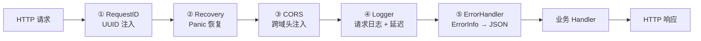

# API 设计规范

## 设计目标

Shepherd API 层设计为统一、类型安全、多协议兼容的接口层。核心原则：

1. **统一信封格式**：所有 REST 响应使用 `ApiResponse[T]` 泛型信封，提供一致的 `success`、`data`、`error`、`metadata` 结构
2. **多传输协议**：REST（请求-响应）+ SSE（服务端推送）+ WebSocket（双向通信），覆盖不同场景
3. **多协议兼容**：通过独立端口同时支持 OpenAI、Anthropic、Ollama、LM Studio 协议，不侵入主逻辑

---

## 统一响应格式

### 成功响应 `ApiResponse[T]`

| 字段 | 类型 | 说明 |
|---|---|---|
| `success` | boolean | 始终为 `true` |
| `data` | T | 泛型业务数据 |
| `metadata` | ResponseMeta | 请求元信息 |

**ResponseMeta 结构：**

| 字段 | 类型 | 说明 |
|---|---|---|
| `timestamp` | string (RFC3339) | 响应生成时间 |
| `requestId` | string | 请求唯一标识（UUID） |
| `latency` | int64 | 处理耗时（毫秒） |

### 分页响应 `PaginatedResponse[T]`

在 `ApiResponse[T]` 基础上增加：

| 字段 | 类型 | 说明 |
|---|---|---|
| `total` | int64 | 总记录数 |
| `page` | int | 当前页码 |
| `pageSize` | int | 每页条数 |

### 错误响应 `ErrorInfo`

| 字段 | 类型 | 说明 |
|---|---|---|
| `error.code` | ErrorCode | 业务错误码枚举 |
| `error.message` | string | 面向用户的错误描述 |
| `error.details` | string | 详细错误信息（可选） |

**错误码与 HTTP 状态码映射：**

| ErrorCode | HTTP 状态码 | 说明 |
|---|---|---|
| `NODE_NOT_FOUND` | 404 | 节点/资源未找到 |
| `INVALID_REQUEST` | 400 | 请求参数无效 |
| `CONFLICT` | 409 | 资源冲突 |
| `TIMEOUT` | 408 | 操作超时 |
| `COMMAND_FAILED` | 500 | 命令执行失败 |
| `NOT_AUTHENTICATED` | 401 | 未认证 |
| `PERMISSION_DENIED` | 403 | 权限不足 |
| `RESOURCE_EXHAUSTED` | 429 | 资源耗尽 |
| `INTERNAL_ERROR` | 500 | 内部错误 |

---

## RESTful API 路由总览

### 系统信息

| 方法 | 路由 | 说明 |
|---|---|---|
| GET | `/api/info` | 服务器版本与构建信息 |
| GET | `/api/system/gpus` | GPU 列表与状态 |
| GET | `/api/system/llamacpp-backends` | 可用 llama.cpp 后端列表 |
| GET | `/api/system/filesystem` | 文件系统目录浏览 |
| POST | `/api/system/filesystem/validate` | 路径有效性验证 |

### 配置管理

| 方法 | 路由 | 说明 |
|---|---|---|
| GET | `/api/config` | 获取当前配置 |
| PUT | `/api/config` | 更新配置 |
| GET/POST/PUT/DELETE | `/api/config/llamacpp/paths` | llama.cpp 路径管理 |
| GET/POST/PUT/DELETE | `/api/config/models/paths` | 模型路径管理 |
| GET/PUT | `/api/config/storage` | 存储配置 |
| GET | `/api/config/storage/stats` | 存储统计信息 |
| GET/PUT | `/api/config/compatibility` | 兼容 API 配置 |
| POST | `/api/config/compatibility/test` | 兼容 API 连接测试 |

### 模型管理

| 方法 | 路由 | 说明 |
|---|---|---|
| GET | `/api/models` | 模型列表（已扫描） |
| GET | `/api/models/loaded` | 已加载模型列表 |
| GET | `/api/models/:id` | 单个模型详情 |
| POST | `/api/models/:id/load` | 加载模型 |
| POST | `/api/models/:id/unload` | 卸载模型 |
| PUT | `/api/models/:id/alias` | 设置模型别名 |
| PUT | `/api/models/:id/favourite` | 设置收藏状态 |
| GET/PUT/DELETE | `/api/models/:id/load-config` | 模型加载配置持久化 |
| POST | `/api/model/scan` | 触发模型扫描 |
| GET | `/api/model/scan/status` | 扫描状态查询 |

### 模型能力与估算

| 方法 | 路由 | 说明 |
|---|---|---|
| GET | `/api/models/capabilities/get` | 获取模型能力标签 |
| POST | `/api/models/capabilities/set` | 设置模型能力标签 |
| GET | `/api/models/capabilities/auto-detect` | 自动检测模型能力 |
| POST | `/api/models/vram/estimate` | 显存估算 |

### Benchmark 压测

| 方法 | 路由 | 说明 |
|---|---|---|
| POST | `/api/models/benchmark` | 创建压测任务 |
| GET | `/api/models/benchmark/tasks` | 任务列表 |
| GET | `/api/models/benchmark/tasks/:id` | 任务详情 |
| POST | `/api/models/benchmark/tasks/:id/cancel` | 取消任务 |
| GET/POST/DELETE | `/api/models/benchmark/configs` | 压测配置管理 |

### 下载管理

| 方法 | 路由 | 说明 |
|---|---|---|
| GET | `/api/downloads` | 下载任务列表 |
| POST | `/api/downloads` | 创建下载任务 |
| GET | `/api/downloads/:id` | 下载任务详情 |
| POST | `/api/downloads/:id/pause` | 暂停下载 |
| POST | `/api/downloads/:id/resume` | 恢复下载 |
| DELETE | `/api/downloads/:id` | 删除下载任务 |

### 模型仓库

| 方法 | 路由 | 说明 |
|---|---|---|
| GET | `/api/repo/files` | 远程仓库文件浏览 |
| GET | `/api/repo/search` | 模型搜索 |
| GET/PUT | `/api/repo/config` | 仓库配置 |
| GET | `/api/repo/endpoints` | 可用端点列表 |

### 进程管理

| 方法 | 路由 | 说明 |
|---|---|---|
| GET | `/api/processes` | 进程列表 |
| GET | `/api/processes/:id` | 进程详情 |
| POST | `/api/processes/:id/stop` | 停止进程 |

### 日志管理

| 方法 | 路由 | 说明 |
|---|---|---|
| GET | `/api/logs/stream` | 实时日志流（SSE） |
| GET | `/api/logs/entries` | 内存日志条目 |
| GET | `/api/logs/files` | 历史日志文件列表 |
| GET | `/api/logs/files/:filename` | 日志文件内容（支持分页与过滤） |
| GET | `/api/logs/files/:filename/stats` | 日志统计信息 |
| DELETE | `/api/logs/files/:filename` | 删除历史日志 |

### 对话管理

| 方法 | 路由 | 说明 |
|---|---|---|
| GET | `/api/conversations` | 对话列表 |
| GET | `/api/conversations/:id` | 对话详情 |
| DELETE | `/api/conversations/:id` | 删除对话 |

### 节点管理

| 方法 | 路由 | 说明 |
|---|---|---|
| GET | `/api/nodes` | 节点列表 |
| GET | `/api/nodes/:id` | 节点详情 |
| POST | `/api/nodes/:id/command` | 向节点发送指令 |
| GET | `/api/nodes/:id/metrics` | 节点指标 |
| GET | `/api/overview` | 集群概览 |
| GET | `/api/tasks` | 集群任务列表 |

### 节点间内部通信（非面向终端用户）

以下路由由 Client 节点自动调用，用于节点注册、心跳和指令轮询：

| 方法 | 路由 | 说明 |
|---|---|---|
| POST | `/api/nodes/register` | Client 节点注册到 Master |
| POST | `/api/nodes/{id}/heartbeat` | Client 心跳上报 |
| GET | `/api/nodes/{id}/commands` | Client 轮询待执行指令 |
| POST | `/api/nodes/{id}/command/result` | Client 上报指令执行结果 |
| DELETE | `/api/nodes/{id}/command/{commandId}` | 取消指令 |

### LangChain

| 方法 | 路由 | 说明 |
|---|---|---|
| POST | `/api/langchain/*` | LangChain 推理端点 |

---

## 兼容 API 设计

系统通过独立端口同时运行多个兼容服务器，每个兼容服务器的路由与原协议完全对齐，内部通过适配器转换为 Shepherd 统一调用。

| 兼容目标 | 默认端口 | 核心端点 | 说明 |
|---|---|---|---|
| OpenAI | 9190（与主服务共享） | `POST /v1/chat/completions`、`POST /v1/completions`、`GET /v1/models` | Chat + Completion API |
| Anthropic | 9170 | `POST /v1/messages` | Messages API |
| Ollama | 11434 | `POST /api/chat`、`POST /api/tags` | Chat + Tags API |
| LM Studio | 1234 | 同 OpenAI 端点 | 完全兼容 OpenAI 协议 |

各兼容 API 通过 `internal/handler/` 下的独立 Handler 实现，每个 Handler 持有 `model.Manager` 引用，将外部协议请求转换为内部模型调用。

---

## SSE 事件规范

### 端点

`GET /api/events` — 基于 Server-Sent Events 的实时事件流。

### 事件格式

每个事件包含以下结构化字段：

| 字段 | 类型 | 说明 |
|---|---|---|
| `type` | string | 事件类型标识（camelCase 命名） |
| `data` | any | 事件负载（类型取决于事件类型） |
| `timestamp` | int64 | Unix 时间戳（秒） |

### 事件类型

所有事件类型采用 **camelCase** 命名规范，与前端代码保持一致。

| 事件类型 | 说明 | 触发场景 |
|---|---|---|
| `modelLoad` | 模型加载完成 | 进程就绪 |
| `modelLoadStart` | 模型开始加载 | 用户触发加载指令 |
| `modelStop` | 模型已卸载 | 用户触发卸载 |
| `download_progress` | 下载进度更新 | 模型下载中 |
| `scan_complete` | 模型扫描完成 | 手动/自动扫描 |
| `node_status_change` | 节点状态变更 | 心跳超时 / 恢复 |
| `clientRegistered` | 客户端节点注册 | 新节点上线 |
| `clientDisconnected` | 客户端节点断开 | 节点离线 |
| `clientResourcesUpdated` | 客户端资源更新 | 心跳携带新资源数据 |
| `taskUpdate` | 集群任务状态变更 | 任务完成/失败 |
| `console` | 控制台消息 | 系统内部通知 |
| `process_metrics` | 进程资源指标 | 定时采集（CPU / 内存） |

### 连接管理

- 服务端每 30 秒发送 `keepalive` 事件维持连接
- 客户端断开后自动释放资源
- 支持多客户端同时订阅
- SSE 客户端默认最大重连 10 次，指数退避（初始 1s，最大 30s，抖动 ±25%）

---

## WebSocket 规范

### 端点

`GET /ws` — WebSocket 升级端点。

### 消息格式

所有消息使用 JSON 编码：

| 字段 | 类型 | 说明 |
|---|---|---|
| `type` | string | 消息类型 |
| `payload` | any | 消息负载 |

### Hub 架构

系统使用 WebSocketHub 模式管理连接：

- **Hub**：中心路由器，维护客户端注册表，负责广播
- **Client**：每个连接对应一个 Client，持有独立的 Send channel
- **WritePump**：独立 goroutine，从 Send channel 读取消息并写入连接
- **ReadPump**：独立 goroutine，从连接读取消息（当前主要用于维持连接）

### 心跳机制

- 服务端每 54 秒发送 WebSocket Ping 帧
- 客户端需回复 Pong 帧
- 读取超时 60 秒，超时后服务端主动关闭连接

### 重连策略（客户端建议）

- 指数退避：初始 1 秒，最大 30 秒
- 加入随机抖动（±25%）防止惊群效应
- 连接失败后最多重试 10 次

---

## 模型加载 API

端点：`POST /api/models/{id}/load`

请求体包含约 50 个参数，分为基础参数、GPU 配置、采样参数、性能优化、KV 缓存、模板系统、视觉模型、服务器配置等类别。详细的参数说明、默认值、后端命令行映射和请求示例请参考 [模型加载 API 文档](./model-loading.md)。

以下为关键参数概览（完整列表见上述文档）：

| 参数 | 类型 | 默认值 | 说明 |
|---|---|---|---|
| `port` | integer | 自动分配 | 服务端口（8081-9000） |
| `ctxSize` | integer | 512 | 上下文大小（tokens） |
| `gpuLayers` | integer | 0 | GPU 层数（99 = 全部） |
| `devices` | string[] | - | GPU 设备列表（如 `["cuda:0", "cuda:1"]`） |
| `temperature` | float64 | 0.70 | 采样温度 |
| `flashAttention` | boolean | false | Flash Attention |

**不支持的参数：** `logitsAll`（仅适用于 llama-cli）和 `directIo`（需要特定文件系统支持）。

---

## 中间件链

Gin Engine 按以下顺序注册全局中间件，形成请求处理管道：

| 序号 | 中间件 | 职责 |
|---|---|---|
| ① | RequestID | 为每个请求生成 UUID，写入 `X-Request-ID` 响应头 |
| ② | Recovery | 捕获 goroutine panic，记录调用栈，返回 500 错误 |
| ③ | CORS | 注入 `Access-Control-*` 响应头，支持可配置的来源白名单 |
| ④ | Logger | 记录请求方法、路径、状态码、处理延迟 |
| ⑤ | ErrorHandler | 拦截 `c.Errors`，将 `ErrorInfo` 类型错误转换为对应的 JSON 响应 |

---

## 设计决策

### 泛型信封 `ApiResponse[T]`

使用 Go 1.18+ 泛型实现类型安全的 API 响应。泛型参数 `T` 使编译器在编译期校验响应数据类型，消除运行时类型断言的风险。配合 `api.Success[T]()`、`api.Paginated[T]()` 等泛型辅助函数，Handler 代码简洁且类型安全。

### 错误码与 HTTP 状态码分离映射

`ErrorCode` 枚举定义业务语义错误，通过 `HTTPStatusCode()` 方法映射到传输层状态码。这种分离使业务逻辑不感知 HTTP 协议细节，便于未来支持 gRPC 等其他传输协议。

### 多协议兼容端口

兼容 API 通过独立端口运行，每个端口对应一个独立的 HTTP Server 实例。兼容 Handler 持有 `model.Manager` 引用，将外部协议请求转换为内部统一调用。这种架构不侵入主服务逻辑，新增兼容协议只需添加 Handler + Server。

### SSE 与 WebSocket 双通道

SSE 适用于服务端单向推送（事件通知），WebSocket 适用于双向通信（未来扩展）。两者独立端点、独立实现，客户端可按需选择。

---

## 相关文档

| 文档 | 说明 |
|---|---|
| [系统架构概览](./architecture.md) | 全局架构、模块依赖、初始化/关闭流程 |
| [分布式节点系统](./node-system.md) | 节点注册、心跳、指令下发协议 |
| [通用进程引擎](./process-engine.md) | 进程生命周期与命令构建 |
| [模型全生命周期管理](./model-management.md) | 模型扫描、加载、能力检测 |
| [模型加载 API](./model-loading.md) | 模型加载参数的完整说明与示例 |
| [日志历史功能](./log-history.md) | 日志文件管理功能设计 |
| [前端架构](../web/architecture.md) | 前端 API 通信层设计 |
