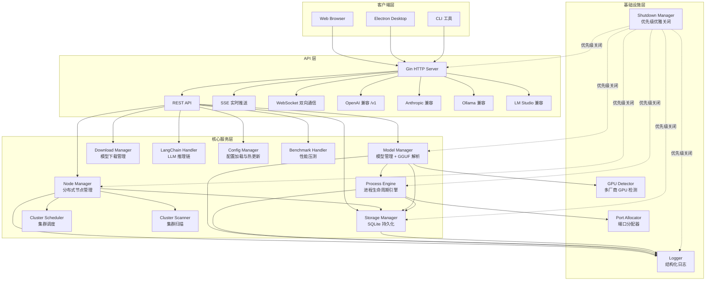
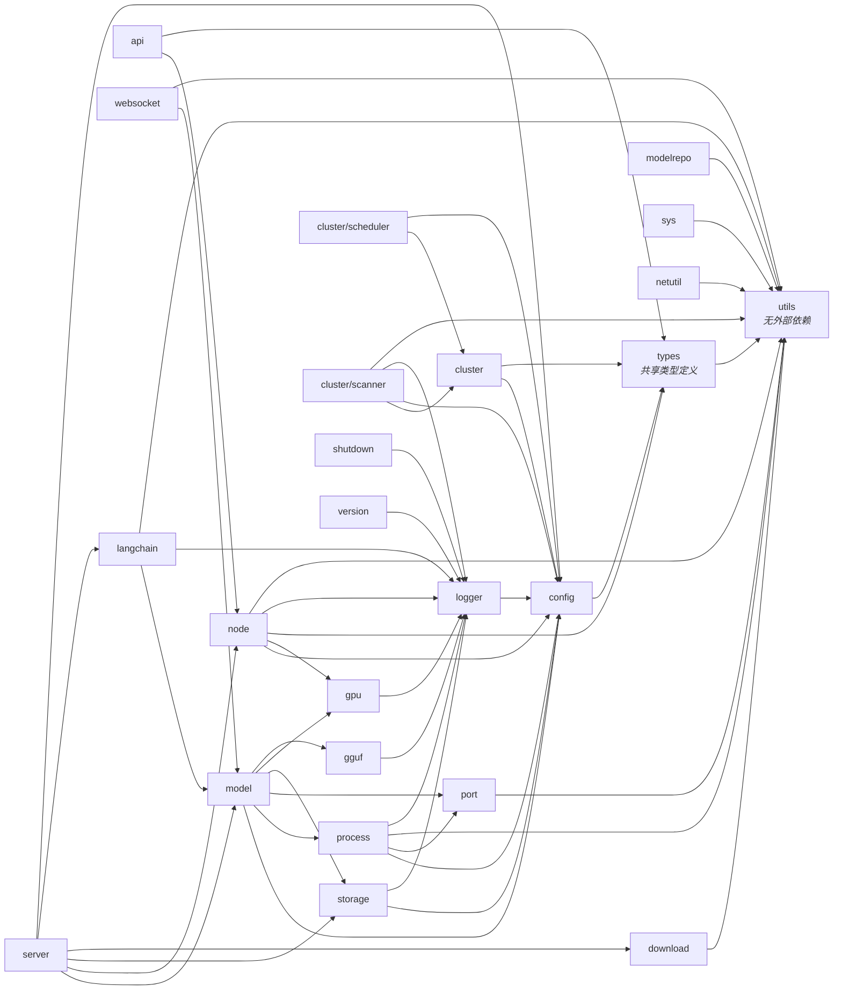
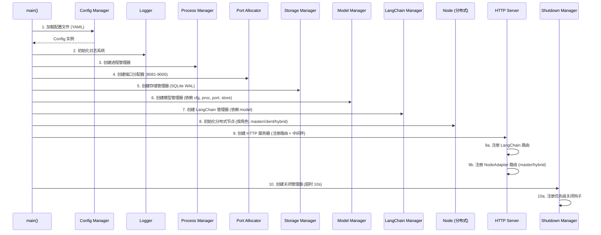
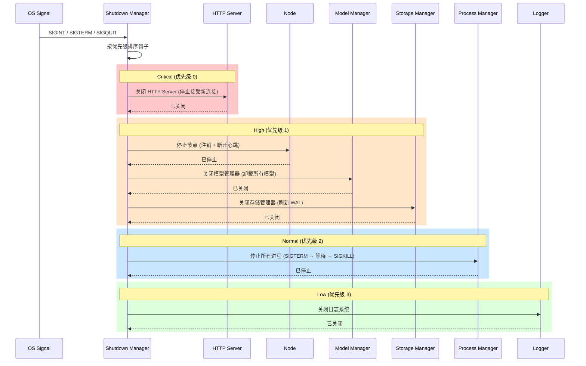

# 系统架构概览

## 设计目标

Shepherd 定位为分布式 llama.cpp 模型管理系统，核心目标是解决多节点环境下大语言模型的统一调度与生命周期管理问题。系统需要在异构硬件（NVIDIA / AMD / CPU）上提供一致的模型加载、卸载、热交换体验，同时支持跨节点的模型分发与协同推理。

在后端进程引擎层面，系统采用"命令字符串 + 宏替换"的后端无关设计。进程管理器不绑定任何特定的推理引擎实现，而是通过模板化的命令行生成机制，将用户参数映射为目标进程的启动参数。这意味着系统可以无缝支持 llama.cpp 的不同版本、不同的推理后端，甚至完全不同的推理引擎。

前端提供现代化 WebUI，后端提供 RESTful API、SSE 实时推送和 WebSocket 双向通信。同时通过独立端口兼容 OpenAI、Anthropic、Ollama、LM Studio 等主流协议，使 Shepherd 能够直接接入现有工具链。

---

## 系统分层架构

---

## 模块依赖关系

下图展示了 `internal/` 下各包之间的依赖方向。箭头从依赖方指向被依赖方。

### 外部 SDK 依赖标注

| 模块 | 关键外部依赖 |
|---|---|
| model | gpustack/gguf-parser-go（GGUF 元数据解析） |
| node | shirou/gopsutil/v3（系统指标采集） |
| server | gin-gonic/gin, gorilla/websocket |
| storage | modernc.org/sqlite（纯 Go SQLite） |
| langchain | tmc/langchaingo |
| download | bodaay/HuggingFaceModelDownloader |
| gpu | ROCm/amdsmi（AMD GPU，条件编译） |

---

## 初始化流程

系统启动时，各组件按严格的顺序初始化，确保每个组件在被使用前其依赖已就绪。

---

## 关闭流程

关闭管理器监听 `SIGINT`、`SIGTERM`、`SIGQUIT` 信号，按优先级依次执行已注册的关闭钩子。每个钩子独立超时，不互相阻塞。

---

## SDK 与第三方库清单

| 库 | 用途 |
|---|---|
| gin-gonic/gin | HTTP 框架，路由与中间件 |
| gorilla/websocket | WebSocket 连接管理 |
| gopkg.in/yaml.v3 | YAML 配置文件解析与序列化 |
| modernc.org/sqlite | 纯 Go SQLite 驱动（无 CGO 依赖） |
| shirou/gopsutil/v3 | 系统指标采集（CPU / 内存 / 磁盘 / 负载） |
| google/uuid | UUID 生成（请求追踪、节点标识） |
| gpustack/gguf-parser-go | GGUF 模型文件元数据解析与 VRAM 估算 |
| ROCm/amdsmi | AMD GPU SMI SDK（通过条件编译启用） |
| stretchr/testify | 测试断言与 Mock 工具 |
| tmc/langchaingo | LangChain Go 集成（Agent / Chain / RAG） |
| bodaay/HuggingFaceModelDownloader | HuggingFace 模型断点续传下载 |
| gomlx/go-huggingface | HuggingFace API 交互（模型搜索） |

---

## 架构设计决策

### 纯 Go SQLite（modernc.org/sqlite）

选择纯 Go 实现而非 CGO 绑定（如 mattn/go-sqlite3），消除了 C 工具链依赖，使交叉编译零配置。代价是约 20-30% 的性能差距，但在 Shepherd 的读写模式下可忽略不计。

### Manager 集中管理模式

每个领域（配置、进程、模型、存储、下载）对应一个 Manager 结构体，持有其依赖的引用。Manager 对外暴露业务方法，内部通过 `sync.RWMutex` 保护共享状态。这种模式使依赖关系显式化，便于测试时注入 Mock。

### 优先级关闭

通过 `ShutdownManager` 的四优先级机制（Critical → High → Normal → Low），确保数据安全写入后再终止进程。每个钩子独立超时控制，避免单个组件阻塞整个关闭流程。

### 原子文件写入

配置文件写入采用 `.tmp` 临时文件 + `os.Rename` 的原子操作模式，防止写入过程中断导致的配置损坏。

### 并发模型

系统统一使用 `RWMutex`（读写锁）+ `Context`（取消传播）+ `WaitGroup`（等待完成）的组合模式。不使用 channel 作为主要并发原语，降低复杂度。

### 适配器模式桥接 Node 与 API

`api.NodeAdapter` 作为适配器，将 `node.Node` 的内部接口转换为 HTTP API 处理器，实现业务逻辑与传输层的解耦。

---

## 跨平台策略

当前后端和 GPU 检测主要面向 Linux 环境。Windows 支持通过 Electron 客户端内嵌 Go 二进制实现（参见 [客户端架构](../client/architecture.md)）。进程管理、GPU 检测等模块在 Windows 上使用对应系统命令（如 `taskkill` 替代 SIGTERM）。

**跨节点多 GPU 分布式推理**（如张量并行跨节点拆分）为未来规划功能，当前版本仅支持单节点多 GPU 和多节点独立加载两种模式。

---

## 相关文档索引

| 文档 | 说明 |
|---|---|
| [API 设计规范](./api-design.md) | RESTful API、SSE、WebSocket、兼容 API 规范 |
| [分布式节点系统](./node-system.md) | 节点角色、注册/心跳/指令协议、调度策略 |
| [通用进程引擎](./process-engine.md) | cmd 字符串 + 宏替换、进程状态机、Process Group、TTL 卸载 |
| [模型全生命周期管理](./model-management.md) | 模型扫描、能力检测、加载/卸载、Benchmark |
| [GPU 与环境检测](./gpu-detection.md) | Provider 模式、多厂商 GPU 检测、llama-bench 集成 |
| [模型加载 API](./model-loading.md) | 模型加载参数详细说明（已被 api-design.md 引用） |
| [日志历史功能](./log-history.md) | 日志文件管理功能设计 |
| [前端架构](../web/architecture.md) | React 19 + Vite 7 前端架构 |
| [Electron 客户端](../client/architecture.md) | Windows 桌面客户端架构（规划中） |
