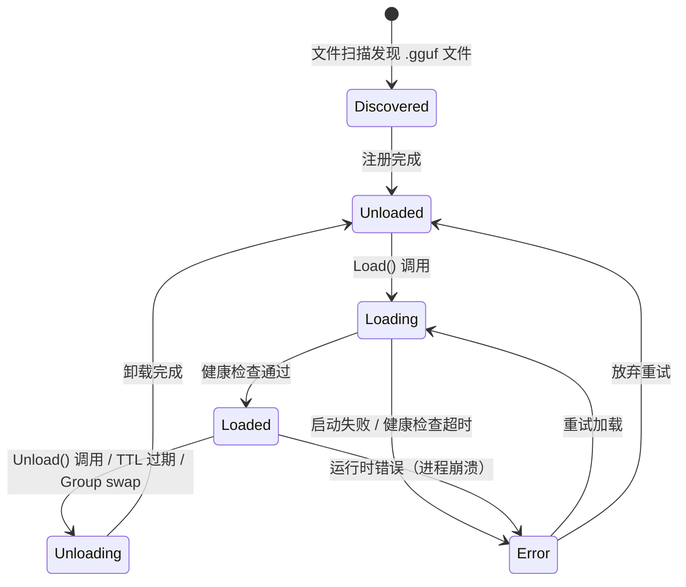
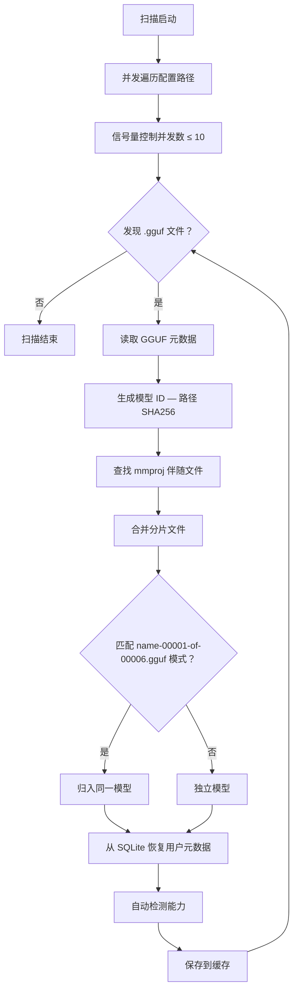
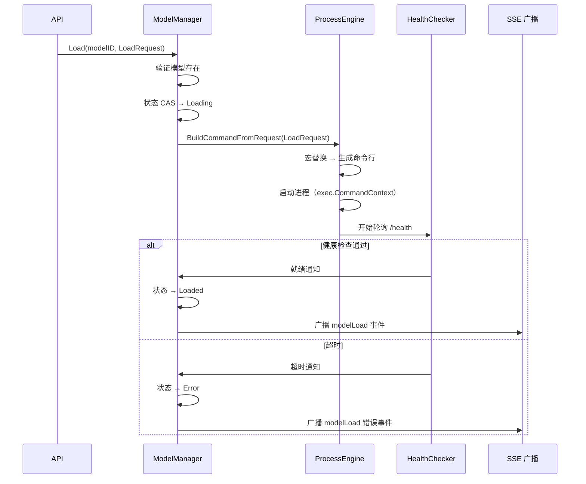

# 模型全生命周期管理

## 设计目标

Shepherd 的模型管理模块负责从模型发现到最终卸载的完整生命周期，涵盖文件系统扫描、GGUF 元数据解析、能力自动检测、加载/卸载编排、性能基准测试以及用户元数据持久化。模块的核心设计原则是"自动化优先"：系统能够自动发现模型文件、推断模型能力、选择合理的加载参数，用户仅需在需要覆盖默认行为时显式配置。

在架构层面，模型管理模块是进程引擎（process-engine.md）的上层编排者。它将模型语义（ID、能力、分组）与进程语义（命令、端口、健康检查）桥接起来，通过 LoadRequest 的 50+ 参数字段覆盖 llama-server 的全部标志位，同时提供合理的默认值机制，确保大多数场景下用户无需关心底层细节。

## 模型状态流转

**状态持久化：** 模型的 LoadState 持久化到 SQLite，节点重启后可恢复。Discovered 是瞬时态，扫描完成后立即转为 Unloaded。

## 核心抽象

模块围绕以下核心类型组织，它们构成了模型管理的领域模型：

| 类型 | 职责 | 关键字段 |
|---|---|---|
| `Model` | 已发现的模型实体 | ID、名称、路径、文件大小、GGUF 元数据、分片信息、Capabilities、使用统计 |
| `ModelStatus` | 模型运行时状态 | ModelID、LoadState、进程 ID、端口、上下文大小、错误信息 |
| `LoadState` | 加载状态枚举 | Unloaded / Loading / Loaded / Unloading / Error |
| `LoadRequest` | 加载请求参数 | 约 50 个字段，覆盖 llama-server 全部标志（ctxSize、batchSize、threads、nGpuLayers、温度、采样参数等） |
| `LoadResult` | 加载操作结果 | 成功/失败、分配端口、加载耗时、异步标志 |
| `Capabilities` | 模型能力集合 | thinking / tools / embedding / rerank，附带互斥约束 |

## 模型扫描流程

**分片合并规则：** 匹配 `{name}-{NNNNN}-of-{TTTTT}.gguf` 命名模式的文件自动归为同一模型。首个分片的元数据作为整个模型的代表。

**缓存策略：** 扫描结果缓存到本地 JSON 文件。二次启动时对比文件修改时间和大小，仅重新解析变更的模型，避免全量 GGUF 解析开销。

## 能力检测机制

能力检测基于关键词匹配，扫描模型名称、GGUF 架构字段和 chat_template 内容。这是一种"简单但有效"的策略，覆盖主流模型的命名和模板规范。

| 能力 | 检测来源 | 关键词示例 |
|---|---|---|
| Thinking | chat_template, name | `enable_thinking`, `deepseek-r1`, `qwq`, `thinking` |
| Tools | chat_template | `tool_call`, `tools`, `mcp`, `function`, `tool_use` |
| Embedding | name | `embedding`, `e5`, `gte`, `jina`, `bge`, `embed` |
| Rerank | name | `rerank`, `reranker`, `cross-encoder` |

### 互斥约束

Embedding 和 Rerank 模型在语义上不具备文本生成能力，因此启用 embedding 或 rerank 能力时，自动禁用 thinking 和 tools。此约束在检测阶段强制执行，防止能力冲突导致的运行时异常。

## 模型加载时序图

**同步与异步变体：** 同步模式下，API 调用阻塞直到健康检查通过或超时；异步模式下，API 立即返回 Loading 状态，客户端通过 SSE 事件监听最终结果。异步模式适用于大模型的长时间加载场景。

**动态超时：** 加载超时根据模型文件大小动态计算——每 GB 约 1 分钟，下限 5 分钟，上限 30 分钟，适应从几百 MB 到上百 GB 的模型规模差异。

## 默认值机制

加载请求通过 ApplyDefaults() 在构建命令前填充未指定的参数。以下为关键默认值：

| 参数 | 默认值 | 说明 |
|---|---|---|
| ctxSize | 512 | 上下文窗口大小（token 数） |
| batchSize | 512 | 批处理大小 |
| threads | 4 | CPU 线程数 |
| temperature | 0.7 | 采样温度 |
| topP | 0.95 | 核采样概率阈值 |
| topK | 40 | Top-K 采样候选数 |
| repeatPenalty | 1.1 | 重复惩罚系数 |
| nPredict | -1 | 最大预测 token 数（-1 为无限） |
| nGpuLayers | 0 | GPU 卸载层数（0 为纯 CPU） |

用户可在 LoadRequest 中覆盖任意参数，未指定的字段自动填充默认值。默认值本身也可通过全局配置文件调整。完整的参数列表和后端命令行映射参见 [模型加载 API 文档](model-loading.md)。

**设备自动发现端到端流程**：llama-bench `--list-devices` → GPU Info → 前端展示可用设备 → 用户选择或自动填充 LoadRequest 的 `devices` 字段。详见 [GPU 检测](gpu-detection.md)。

## 端口分配

PortAllocator 负责为每个加载的模型分配独立的监听端口：

| 特性 | 说明 |
|---|---|
| 可配置范围 | 默认 8081–9000，通过 `model.port_range` 配置 |
| 分配策略 | 顺序扫描，释放后可重用 |
| 冲突检测 | 双重验证——内存已分配记录 + 实际 TCP 连接探测 |
| 释放时机 | 模型卸载完成后立即释放，归还可用池 |

## 模型元数据持久化

模型相关的用户数据和运行配置通过 Storage 层持久化到 SQLite：

| 数据类别 | 存储内容 | 键 |
|---|---|---|
| 用户元数据 | 别名、收藏、标签、描述 | modelID |
| 加载配置 | LoadRequest 完整参数 | (nodeID, modelID) |
| 运行统计 | 加载次数、最近加载时间 | modelID |
| 能力覆盖 | 用户手动覆盖的自动检测结果 | modelID |

底层使用 SQLiteStore 实现，启用 WAL 模式以支持并发读写，配置 64MB 页面缓存提升查询性能。MemoryStorage 作为测试环境的无依赖替代方案。

## Benchmark 集成

模型管理模块内置性能基准测试能力：

- **任务创建：** 选择目标模型，配置测试参数（上下文大小、批大小、GPU 层数、并发数、prompt 长度）
- **执行控制：** 通过进程引擎启动独立的 benchmark 进程，与正常推理进程隔离
- **结果存储：** 测试结果（tokens/s、首 token 延迟、内存占用）持久化到 SQLite
- **对比分析：** 支持同一模型不同配置、不同模型同一配置的横向对比

## 设计决策

| 决策 | 理由 |
|---|---|
| GGUF 元数据解析（gguf-parser-go） | 直接从模型二进制文件提取架构、模板信息，无需额外配置 |
| 关键词能力检测 | 简单有效，覆盖主流模型命名规范，误报率低 |
| 互斥约束（embedding/rerank 禁用 thinking/tools） | 语义层面不可共存，检测阶段强制约束优于运行时报错 |
| 异步加载 + 动态超时 | 大模型加载耗时不固定，动态超时避免"一刀切"的等待或过早放弃 |
| 路径 SHA256 作为模型 ID | 稳定且唯一，不依赖文件名或用户输入 |
| LoadRequest 50+ 参数扁平化 | 直接映射 llama-server 标志位，无抽象损耗，便于未来扩展 |

## SDK

| 依赖 | 用途 |
|---|---|
| `gpustack/gguf-parser-go` | GGUF 二进制文件解析，提取模型架构、上下文长度、chat_template 等元数据 |

其余功能基于 Go 标准库和项目内部 Storage 抽象实现。

## 相关文档

- [全局架构](architecture.md) — 系统整体架构与模块关系
- [通用进程引擎](process-engine.md) — 模型加载底层依赖的进程管理能力
- [GPU 检测](gpu-detection.md) — GPU 信息采集与 nGpuLayers 自动配置
