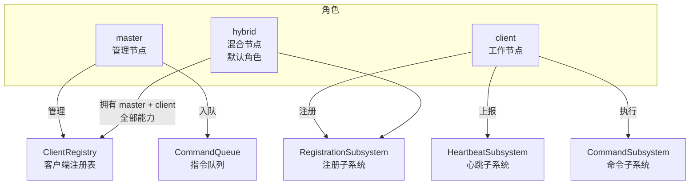
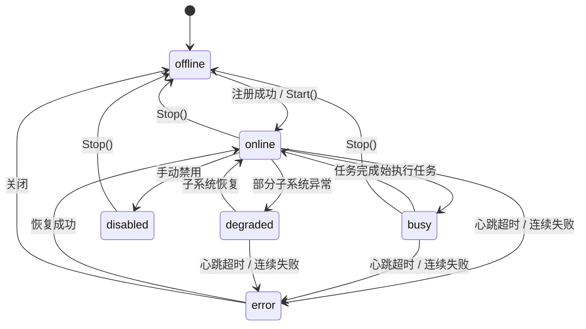
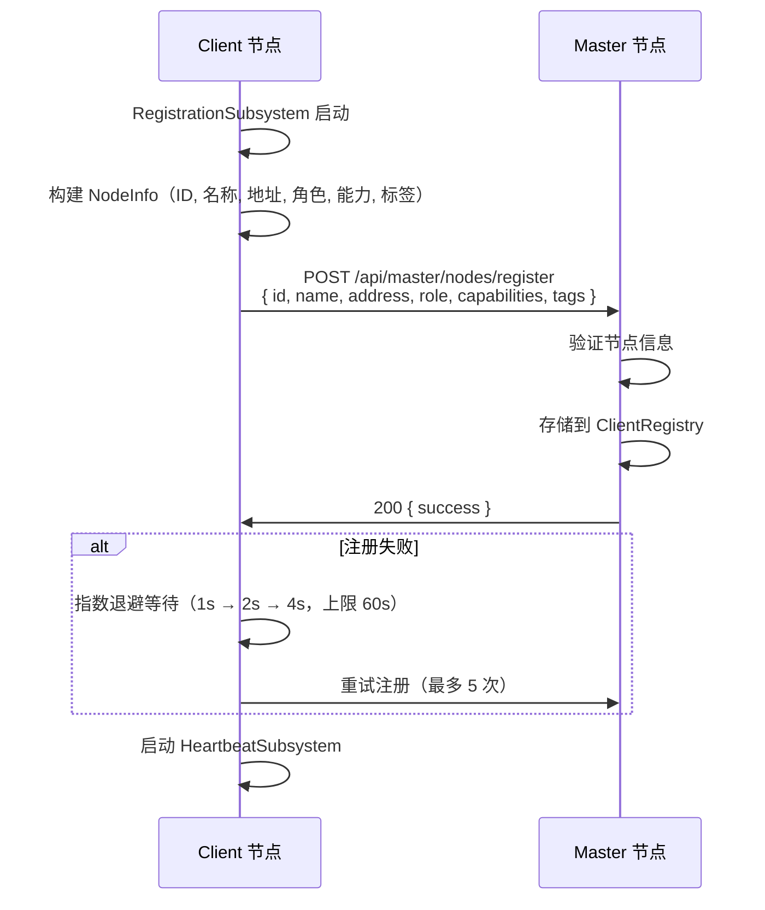
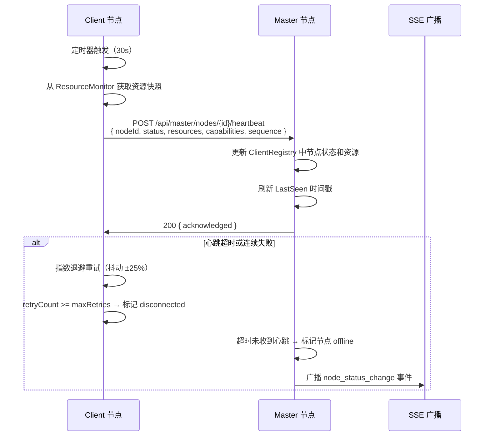
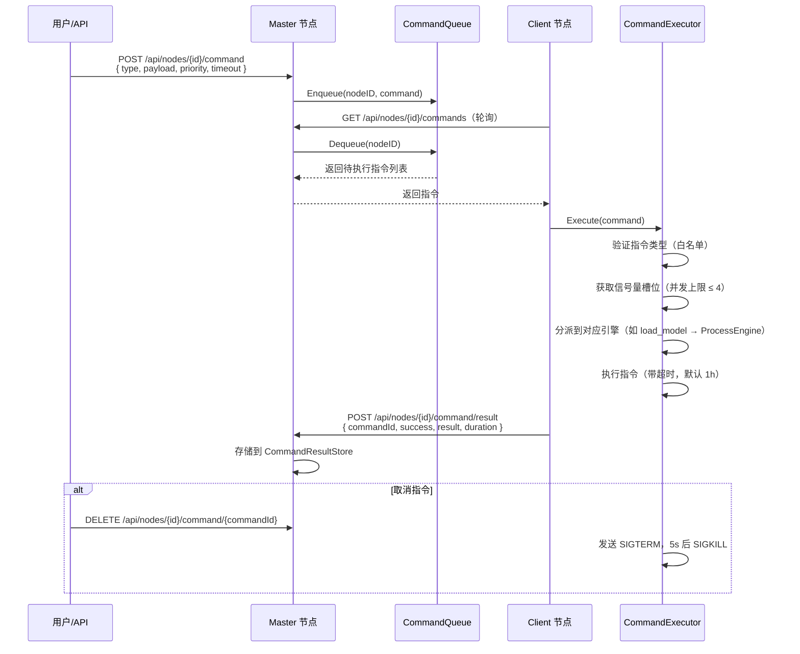

# 分布式节点系统

## 1. 设计目标

Shepherd 节点系统旨在实现多节点的自动发现与可靠连接。系统支持 master/client/hybrid 三种角色，主节点可向工作节点下发模型加载、进程管理等运行指令。节点之间通过 HTTP 协议进行注册、心跳和指令通信，所有状态变更通过 SSE 事件实时广播至前端。

系统同时支持网络节点和 Pod 节点两种部署形态。网络节点通过子网扫描自动发现同网段内的在线节点；Pod 节点在容器编排环境中运行，通过环境变量或配置文件指定 Master 地址完成注册。节点间实时同步状态、资源和能力信息，为模型调度和资源分配提供全局视图。

## 2. 节点角色模型

| 子系统 | master | client | hybrid |
|---|:---:|:---:|:---:|
| ClientRegistry（客户端注册表） | **启用** | - | **启用** |
| CommandQueue（指令队列） | **启用** | - | **启用** |
| RegistrationSubsystem（注册） | - | **启用** | **启用** |
| HeartbeatSubsystem（心跳） | - | **启用** | **启用** |
| CommandSubsystem（命令处理） | **启用** | - | **启用** |
| ResourceMonitor（资源监控） | **启用** | **启用** | **启用** |

## 3. 核心抽象

**INode 接口** — 节点的核心身份与生命周期。提供 ID、名称、角色、状态等身份信息；Start/Stop 生命周期管理；Health 健康检查（内存 > 95% 标记异常、磁盘 > 95% 标记异常）；GetConfig/UpdateConfig 配置管理；GetCapabilities/GetResources 能力与资源查询。

**ClientRegistry 接口** — Master 角色持有的客户端注册表。支持 Register/Unregister 注册与注销、Get/List/Find 查询、UpdateStatus/UpdateResources 状态与资源更新、GetOnlineClients 在线列表、Cleanup 过期清理。

**CommandQueue 接口** — 指令队列管理。支持 Enqueue/Dequeue 入队出队、Peek 查看、Cancel 取消、GetQueueSize/ListQueuedCommands 查询、ClearQueue 清空、RetryCommand 重试。

**IResourceMonitor 接口** — 资源监控。Start/Stop 启停、GetSnapshot 获取快照、Watch 注册回调、SetUpdateInterval 设置间隔、GetMetrics 获取历史指标、GetGPUInfo/GetLlamacppInfo 获取硬件信息。

**Subsystem 接口** — 可插拔子系统，由 SubsystemManager 统一管理。每个子系统实现 Name/Start/Stop/IsRunning 四个方法。SubsystemManager 按依赖顺序启动（registration → heartbeat → commands → resource），按逆序停止。

## 4. 节点状态机

**心跳规则**：HeartbeatSubsystem 默认 30s 间隔向 Master 发送心跳，Master 侧通过 LastSeen 时间戳判断超时（默认 15s，即 3 × ResourceMonitor 采集周期）。连续失败达到 maxRetries（默认 5 次）后，HeartbeatManager 标记节点断开连接，Master 侧将节点标记为 offline 并通过 SSE 广播 `node_status_change` 事件。

> **注意**：ResourceMonitor 采集间隔（5s）和 HeartbeatSubsystem 心跳间隔（30s）是两个独立的定时器。前者采集本地资源数据供心跳上报使用，后者控制向 Master 发送心跳的网络请求频率。

## 5. 节点注册时序

## 6. 心跳协议时序

## 7. 指令下发时序

## 8. 资源监控

ResourceMonitor 以可配置间隔（默认 5s）周期性采集节点资源信息，采集内容包括：

- **CPU 使用率**：通过 gopsutil/v3 获取百分比，转换为 millicores 单位
- **内存**：总量和已用量（字节）
- **磁盘**：根分区总量和已用量（字节）
- **系统负载**：1 分钟、5 分钟、15 分钟平均负载
- **GPU 信息**：委托 `gpu.Detector` 进行多厂商检测和动态更新
- **llama.cpp**：检测可执行文件路径、版本、GPU 后端、支持格式
- **ROCm 版本**：多策略检测（version 文件 → hipcc → rocm-smi）
- **内核版本**：通过 gopsutil/v3 获取

采集采用回调模式：ResourceMonitor 每次更新资源后，创建数据副本并通过回调函数异步更新 Node 的资源字段，避免在回调中直接获取 Node 锁导致死锁。

## 9. 网络扫描发现

Scanner 组件负责并发扫描子网，检测在线的 Shepherd 节点。扫描过程使用 HTTPClient 接口抽象（而非直接依赖 http.Client），便于单元测试中注入模拟响应。Scanner 支持配置为定时自动扫描模式，发现的节点信息汇总后供用户选择连接。

## 10. 任务调度

Scheduler 组件采用策略模式实现负载分配，内置三种调度策略：

- **round_robin**：轮询分配，依次选择在线节点
- **least_loaded**：最少负载优先，选择当前任务数最少的节点
- **resource_aware**：资源感知，综合 CPU、内存、GPU 显存等因素选择最优节点

调度器采用生产者-消费者模型：任务通过 dispatchLoop 从队列中取出，根据策略选择目标节点后分发执行。支持显式指定目标节点或由调度器自动选择。

## 11. 设计决策

| 决策 | 原因 |
|---|---|
| HTTP 轮询而非 gRPC | 简化部署，兼容容器环境和反向代理，无需额外服务端框架 |
| 子系统可插拔 | 不同角色启用不同能力集合，hybrid 角色自动拥有 master + client 全部能力 |
| 指令队列 + 轮询 | 简化 Master 端实现，无需维护长连接，Client 端主动拉取指令 |
| 信号量控制并发执行 | 防止资源耗尽，默认最大并发 4 个指令 |
| 回调模式异步更新资源 | 避免在 ResourceMonitor 回调中直接获取 Node 锁导致死锁 |
| 指数退避 + 抖动 | 心跳和注册失败时避免惊群效应，抖动范围 ±25% |

## 12. SDK

| SDK | 用途 |
|---|---|
| gopsutil/v3 | CPU、内存、磁盘、系统负载、主机信息采集 |
| google/uuid | 节点和指令的唯一标识符生成 |

## 13. 相关文档

- [全局架构](architecture.md) — 系统全局架构与启动流程
- [GPU 检测](gpu-detection.md) — GPU 检测与资源上报机制
- [通用进程引擎](process-engine.md) — 进程生命周期管理，CommandExecutor 将 load_model 等指令分派至此引擎执行
