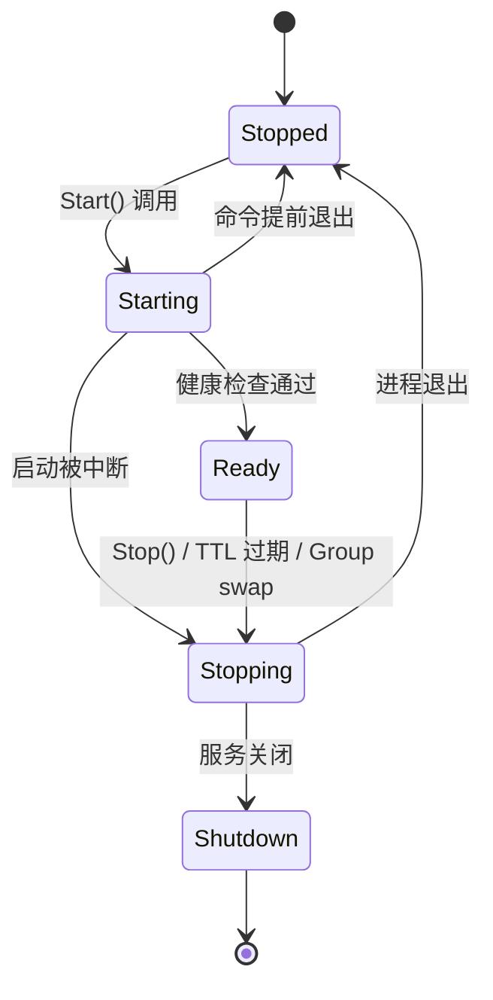
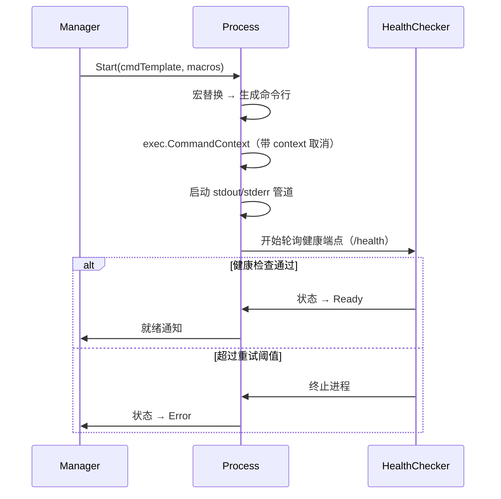
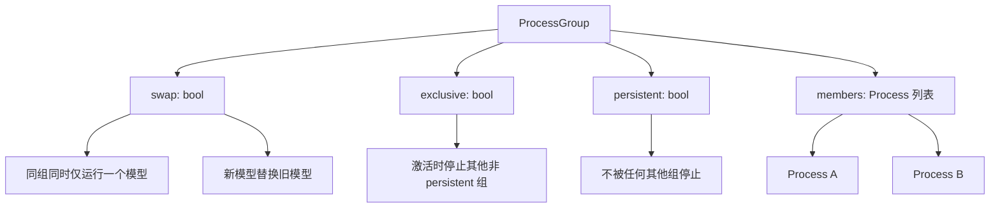
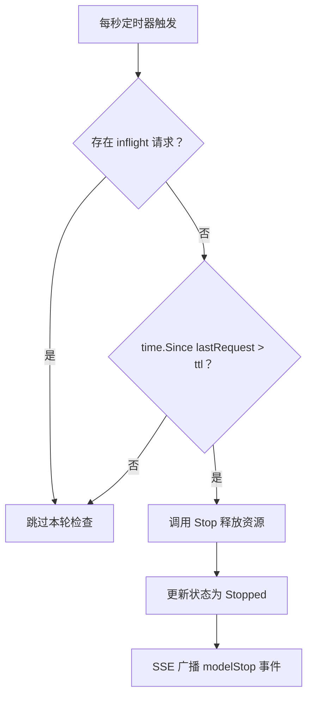
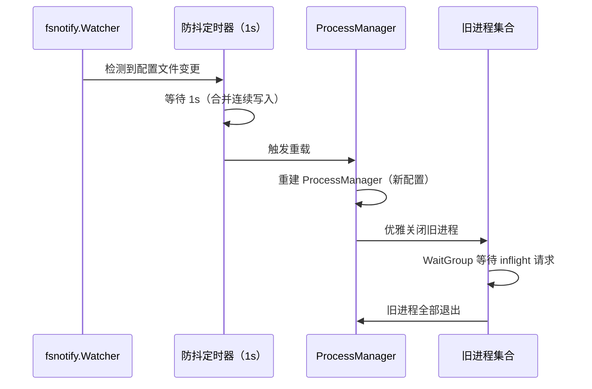

# 通用进程引擎

## 设计目标

Shepherd 需要一个后端无关的进程管理引擎，能够驱动任意推理后端（llama.cpp、vllm、Ollama、Docker 容器等），而无需为每种后端编写适配代码。核心思路借鉴 llama-swap 的 cmd 字符串 + 宏替换模式：每个模型配置一个命令模板字符串，启动时通过宏替换生成实际命令行，从而将后端差异完全收敛到配置层。引擎同时负责完整的进程生命周期管理——包括状态机驱动的启停控制、基于 HTTP 的健康检查、信号量级别的优雅停止，以及 TTL 自动卸载。

在此基础上，引擎引入 Process Group 机制对模型进行分组管理，支持 swap（同组互斥替换）、exclusive（激活时驱逐其他组）和 persistent（不可被驱逐）三种组策略。结合反向代理模式和配置热重载能力，引擎为上层模型管理提供了一个统一、可扩展的进程编排层。

## 进程状态机

每个受管进程维护一个有限状态机，状态转换通过 compare-and-swap（CAS）操作配合互斥锁保证线程安全，确保并发场景下的状态一致性。

**状态说明：**

| 状态 | 含义 |
|---|---|
| Stopped | 进程未运行，初始态 |
| Starting | 进程已启动，等待健康检查通过 |
| Ready | 进程就绪，可接受推理请求 |
| Stopping | 正在停止，等待进程退出 |
| Shutdown | 服务关闭导致的终态 |

CAS 保证无锁快速路径：若当前状态不符合预期转换前提，操作直接返回失败，避免不必要的锁竞争。

## cmd 字符串 + 宏替换机制

每个后端通过一个 cmd 模板字符串定义启动方式。宏替换在配置加载时一次性执行，运行时零开销，类型保持不变（数字宏替换后仍为数字，不会变成字符串）。

### 内置宏表

| 宏 | 说明 | 示例值 |
|---|---|---|
| `${PORT}` | 由 PortAllocator 自动分配的端口 | `8081` |
| `${MODEL_PATH}` | 模型文件的绝对路径 | `/models/llama-2-7b.gguf` |
| `${MODEL_ID}` | 模型标识符 | `llama-2-7b` |
| `${PID}` | 进程 ID（运行时注入） | `12345` |
| `${env.XXX}` | 从 OS 环境读取变量 | `${env.HOME}` → `/home/user` |

### 自定义宏

支持全局自定义宏和模型级自定义宏，模型级宏优先级更高。宏支持引用其他宏，形成宏链。例如全局定义 `${MY_GPU} = 99`，模型级可覆盖为 `${MY_GPU} = 0`。

### cmdStop 覆盖

默认停止行为为 SIGTERM，但可通过 `cmdStop` 字段覆盖。典型场景：Docker 容器需要 `docker stop ${MODEL_ID}` 而非直接信号。`cmdStop` 同样支持宏替换。

### 配置示例（概念性）

| 场景 | cmd 模板 |
|---|---|
| llama.cpp | `llama-server --port ${PORT} -m ${MODEL_PATH} -ngl 99` |
| Docker | `docker run -p ${PORT}:8080 -v ${MODEL_PATH}:/model.gguf llama-image` |
| vllm | `python -m vllm.entrypoints.openai.api_server --port ${PORT} --model ${MODEL_PATH}` |

## 进程生命周期时序图

健康检查采用指数退避策略，初始间隔 1s，最大间隔 5s，总超时取决于模型大小（参见 model-management.md 中的动态超时机制）。

## Process Group 架构

**三维控制的应用场景：**

| 维度 | 场景 | 说明 |
|---|---|---|
| swap | LLM 模型组 | 显存有限，同组 LLM 互斥替换 |
| exclusive | 特殊推理任务 | 需要独占 GPU 资源时激活 |
| persistent | Embedding/Rerank 模型 | 常驻服务，不被 LLM swap 影响 |

未分配组的模型自动归入默认组，默认组行为取决于全局配置。

## TTL 自动卸载流程

inflight 请求通过 WaitGroup 追踪。当存在活跃请求时，TTL 检查直接跳过，避免在推理过程中意外卸载模型。

## 反向代理模式

引擎使用 `httputil.ReverseProxy` 将推理请求转发到对应的上游进程，实现请求路由与模型进程的解耦。

**路由机制：** 仅从请求体的 `model` 字段提取模型标识，以此确定目标进程的监听端口，不解析完整请求体。

**超时配置：**

| 参数 | 说明 |
|---|---|
| connectTimeout | 建立到上游的 TCP 连接超时 |
| responseHeaderTimeout | 等待上游响应头的超时 |
| tlsHandshakeTimeout | TLS 握手超时 |
| expectContinueTimeout | 100-Continue 响应超时 |
| idleConnTimeout | 空闲连接保持超时 |

**并发控制：** 通过信号量通道（默认容量 10）限制并行转发请求数。超出限制时返回 HTTP 429 状态码，提示客户端稍后重试。

## 配置热重载

1s 防抖用于合并编辑器保存时的多次连续写入事件，避免中间态配置被加载。

## 优雅停止策略

引擎根据不同场景选择停止策略：

| 策略 | 触发场景 | 行为 |
|---|---|---|
| cmdStop | 配置了自定义停止命令 | 执行 `cmdStop` 宏替换后的命令 |
| 默认停止 | 无 cmdStop | SIGTERM → 等待 gracePeriod（10s）→ SIGKILL |
| WaitForInflight | TTL 过期、Group swap | 等待所有 inflight 请求完成后再停止 |
| Immediately | API 主动卸载、服务关闭 | 立即发送 SIGTERM，不等待 inflight |

所有策略最终都通过 context 取消机制传播停止信号，确保子进程树（包括 shell 子进程）被完整回收。

## 进程监控

| 指标 | 数据源 | 采集方式 |
|---|---|---|
| CPU 使用率 | `/proc/{pid}/stat` | 计算 utime + stime 的增量 |
| 内存 RSS | `/proc/{pid}/statm` | RSS pages × 4KB |
| 进程存活 | 进程信号 | Wait 系统调用 |
| 服务就绪 | HTTP GET /health | 定时轮询 |

**日志管理：** 每个进程维护一个循环日志缓冲区（默认 100 行），捕获 stdout/stderr 输出，供 API 查询和 SSE 事件推送。

**指标回调：** 监控数据通过回调函数向上层报告，由 ModelManager 聚合后存储和广播。

## 设计决策

| 决策 | 理由 |
|---|---|
| cmd 字符串而非类型化 Backend 接口 | 最大灵活性，新增后端零代码改动，仅需配置 |
| 宏替换在配置加载时执行 | 运行时零开销，类型安全保持 |
| CAS 状态机 | 无锁快速路径下的线程安全，适合高频状态查询 |
| httputil.ReverseProxy | Go 标准库方案，成熟可靠，无额外依赖 |
| 信号量并发控制 | 轻量级限流，避免上游过载 |
| fsnotify + 防抖 | 标准文件监听方案，防抖避免中间态加载 |

## SDK

无额外 SDK 依赖。引擎基于 Go 标准库构建：

| 标准库包 | 用途 |
|---|---|
| `os/exec` | 进程启动与管理 |
| `net/http/httputil` | 反向代理 |
| `os/signal` | 信号处理 |
| `sync/atomic` | CAS 状态机 |
| `context` | 取消传播与超时控制 |

## 跨节点调用关系

当 Master 节点向 Client 节点下发 `load_model` 指令时，Client 节点的 CommandExecutor 根据指令类型将执行分派到本引擎。具体的调用链路为：Master 入队指令 → Client 轮询获取 → CommandExecutor 分派 → ProcessEngine 执行进程管理。详见 [节点系统](node-system.md) 指令下发时序。

## 相关文档

- [全局架构](architecture.md) — 系统整体架构与模块关系
- [模型管理](model-management.md) — 模型加载流程使用本引擎的进程管理能力
- [节点系统](node-system.md) — 跨节点指令触发远程进程操作
- [GPU 检测](gpu-detection.md) — llama-bench 设备列表与本引擎的设备参数映射
