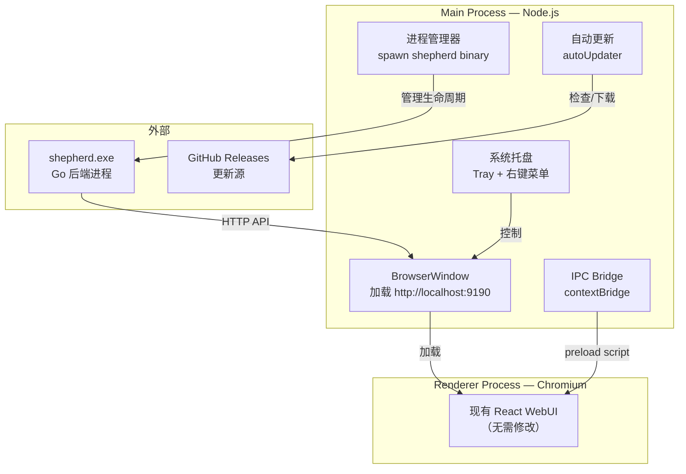
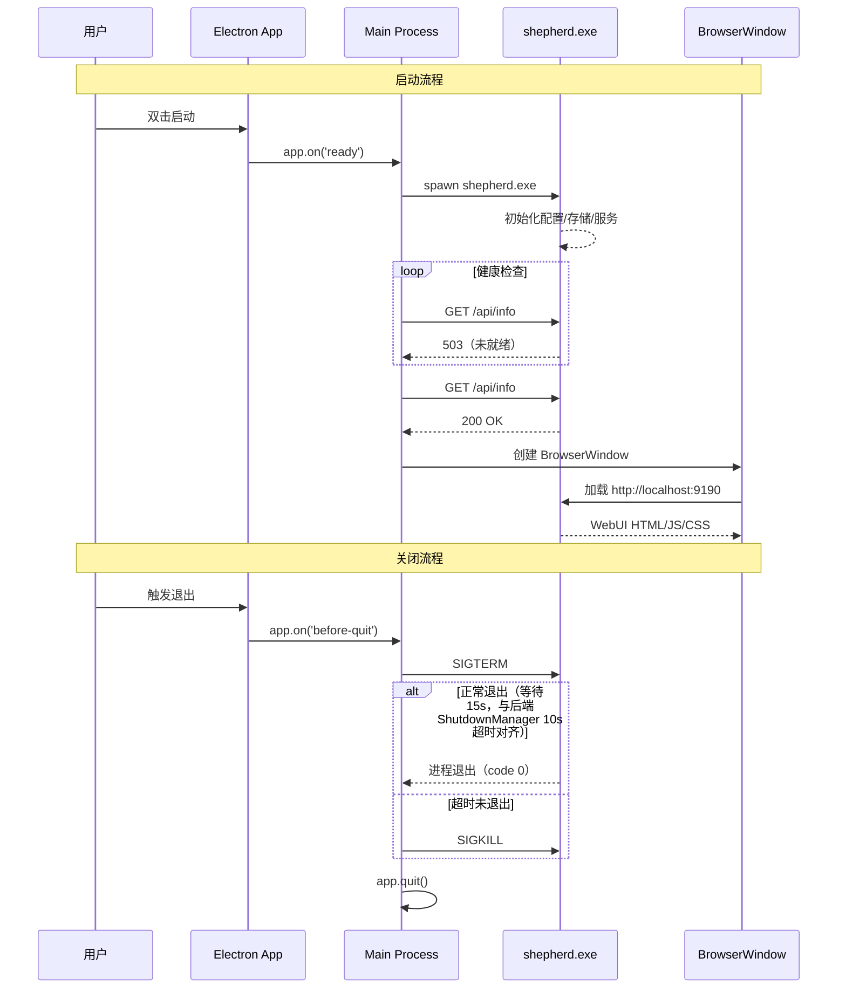

# Electron 桌面客户端

> **文档状态**：本文档描述的是规划中的功能，尚未实现。代码仓库中不存在 `electron/` 或 `client/` 目录。

## 设计目标

Shepherd Electron 桌面客户端面向 Windows 用户，提供开箱即用的本地部署体验。客户端内嵌 Go 后端二进制文件，启动时自动拉起本地服务进程，用户无需手动安装 Go 环境或执行命令行操作。

客户端的核心设计原则是**最大化复用现有 WebUI 代码**。Renderer 进程直接加载 WebUI 的构建产物，不引入任何前端代码修改。Electron 层仅负责系统级能力的桥接：本地进程管理、系统托盘、自动更新和原生窗口控制。这一策略使 Web 端和桌面端共享同一份前端代码库，将维护成本降至最低。

## Electron 进程模型



## 核心架构

### Main Process 职责

Main Process 是 Electron 应用的主进程，运行在 Node.js 环境中，承担以下核心职责：

- **本地 Go 后端进程管理**：spawn/shepherd 二进制文件，监控进程健康状态，处理崩溃重启
- **BrowserWindow 管理**：创建应用主窗口，加载本地后端的 WebUI 地址
- **系统托盘**：常驻系统托盘图标，提供右键菜单控制
- **自动更新**：集成 electron-updater，从 GitHub Releases 检查并下载更新
- **原生菜单**：应用菜单栏、右键上下文菜单

### Renderer Process

Renderer Process 为标准 Chromium 渲染环境，直接加载 WebUI 的 `dist/` 产物。由于通过 `http://localhost:9190` 加载而非 `file://` 协议，SSE 和 WebSocket 通信与开发模式完全一致，无需任何适配。

### IPC Bridge

Renderer 通过 preload script（`contextBridge`）与 Main Process 通信。preload 暴露安全的 API 接口，不将 Node.js 能力直接暴露给 Renderer，确保进程间通信的安全性。

## 本地服务嵌入



## 系统托盘

系统托盘提供后台运行能力，用户关闭窗口时应用最小化到托盘而非退出。托盘功能包括：

- 托盘图标，显示后端运行状态
- 右键菜单：显示/隐藏窗口、打开浏览器访问 WebUI、检查更新、退出
- 双击托盘图标恢复主窗口
- 后台运行模式下持续保持 Go 后端进程活跃

## 自动更新

自动更新基于 electron-updater 实现，以 GitHub Releases 作为更新分发源。更新策略：

- 应用启动时自动检查新版本（静默）
- 发现更新后在后台下载，不中断用户使用
- 下载完成后通过 IPC 通知 Renderer 显示安装提示
- 用户确认后执行重启安装

## IPC 通道设计

| 通道 | 方向 | 说明 |
|---|---|---|
| `backend:status` | Main → Renderer | 后端进程状态（启动中/运行中/已停止/异常） |
| `backend:start` | Renderer → Main | 请求启动后端进程 |
| `backend:stop` | Renderer → Main | 请求停止后端进程 |
| `window:minimize` | Renderer → Main | 最小化窗口到系统托盘 |
| `update:check` | Renderer → Main | 触发更新检查 |
| `update:available` | Main → Renderer | 通知有可用更新（附带版本信息） |
| `update:downloaded` | Main → Renderer | 更新已下载完成，可安装 |

## 打包与分发

应用使用 electron-builder 进行打包，内嵌 Go 交叉编译的 Windows 二进制文件，实现真正的单机部署。

安装目录结构：

```
app/
├── shepherd.exe            Go 后端二进制
├── resources/
│   └── app.asar            Electron 应用打包
└── config/                 配置文件目录
```

分发格式：

- **NSIS 安装包**：标准 Windows 安装程序，支持开始菜单快捷方式和卸载
- **便携版**：自包含目录，解压即用，无需安装

## 离线模式

当 Renderer 检测到后端不可用时（API 请求连续失败），显示离线提示界面并提供以下选项：

- **重新连接**：重试 API 健康检查
- **重启后端**：通过 IPC 请求 Main Process 重启 Go 后端进程
- **查看日志**：展示后端进程的 stderr 输出，辅助故障排查

Main Process 持续监控 Go 后端进程状态。若进程意外崩溃，自动执行重启并通知 Renderer 更新状态显示。重启策略采用有限次数重试（最多 3 次），避免无限循环。

## 技术选型

| 类别 | 技术 | 说明 |
|---|---|---|
| 桌面框架 | Electron | Node.js + Chromium，成熟稳定的跨平台方案 |
| 打包工具 | electron-builder | 支持多平台构建与自动更新集成 |
| 更新机制 | electron-updater | 基于 GitHub Releases 的自动更新 |
| 前端界面 | 复用 WebUI | 零改动加载，共享同一份代码库 |
| 后端服务 | 内嵌 Go 二进制 | 交叉编译的 Windows 可执行文件，无需运行时依赖 |

## 原生能力集成

作为桌面客户端，Electron Main Process 提供以下系统级能力桥接：

| 能力 | 实现方式 | 说明 |
|---|---|---|
| 文件对话框 | `dialog.showOpenDialog` | 选择模型文件/目录路径 |
| 系统通知 | `Notification` API | 模型加载完成、下载完成等通知 |
| 开机自启动 | `app.setLoginItemSettings` | 可选的系统启动时自动运行 |
| 协议处理器 | `app.setAsDefaultProtocolClient` | `shepherd://` URL scheme 深度链接 |
| 崩溃报告 | `crashReporter` | 上传崩溃转储用于问题排查 |

## 跨平台支持

当前规划仅面向 Windows 平台（NSIS 安装包 + 便携版）。未来可扩展至：

- **macOS**：`.dmg` 安装包，通过 `electron-builder` 的 `mac` target 构建
- **Linux**：`AppImage` / `.deb` 包，内嵌 Linux 版 Go 二进制

由于 Renderer 直接加载 localhost WebUI，跨平台适配工作集中在 Main Process 的进程管理和原生集成层，前端代码无需修改。

## 设计决策

| 决策 | 理由 |
|---|---|
| Electron 而非 Tauri | 团队 Web 技术栈成熟，最大化复用现有 WebUI 代码，降低学习成本 |
| 内嵌 Go 二进制而非远程服务 | 真正的本地部署，无网络依赖，数据不出本机 |
| BrowserWindow 加载 localhost 而非 file:// 协议 | 与开发模式完全一致，SSE/WebSocket 无需额外适配 |
| preload script IPC 桥接 | 安全的进程间通信，不暴露 Node.js API 给 Renderer，符合 Electron 安全最佳实践 |
| Go 进程崩溃自动重启 | 提升用户体验，减少因后端意外退出导致的手动干预 |

## 相关文档

- [前端架构](../web/architecture.md) — WebUI 架构设计，桌面客户端直接复用
- [后端架构](../backend/architecture.md) — Go 后端架构，桌面客户端内嵌运行
