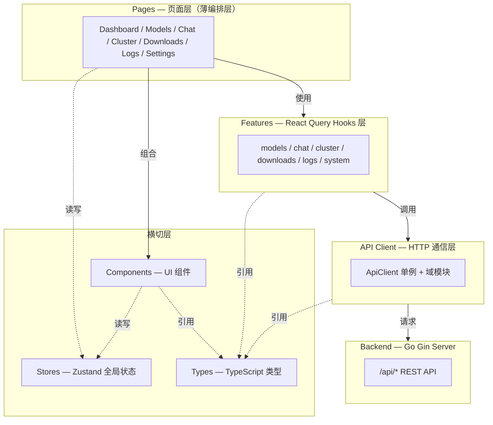
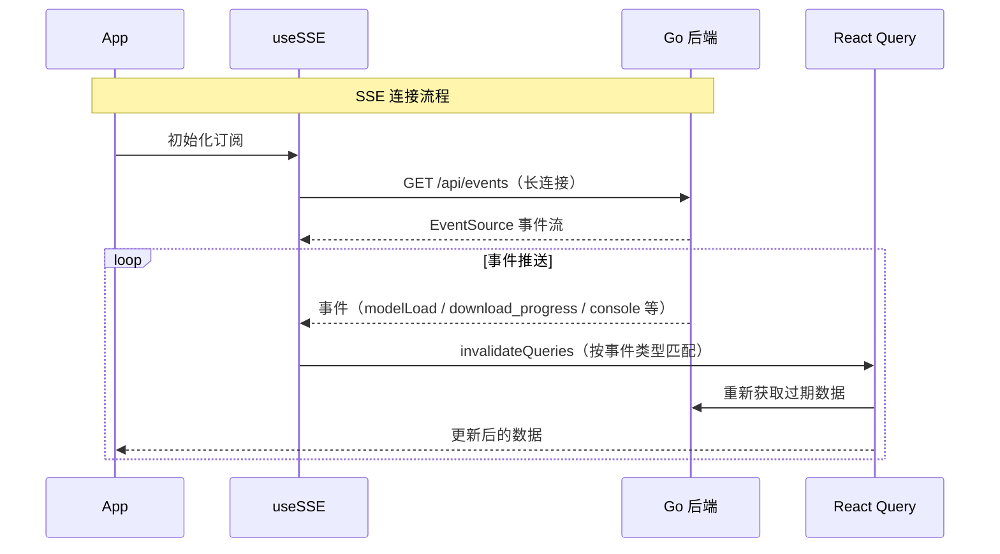
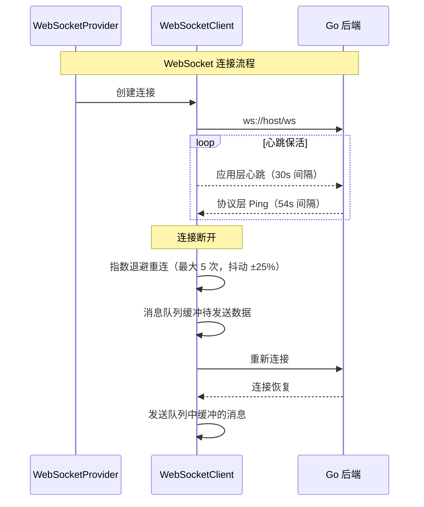
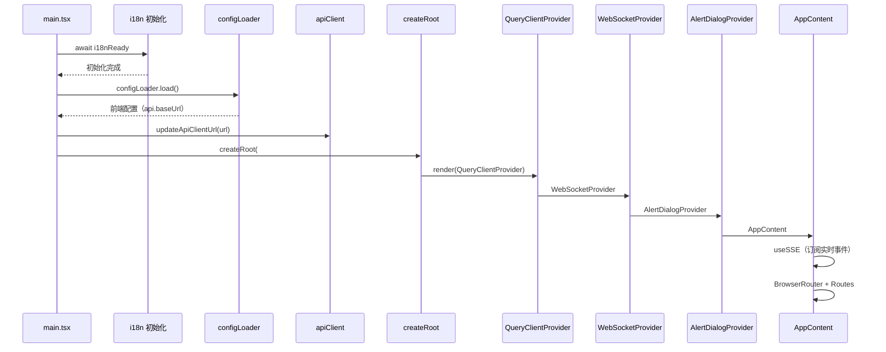
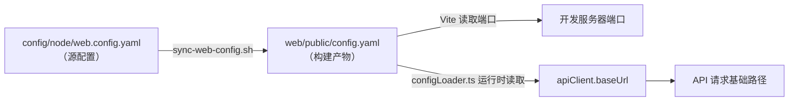

# 前端架构

## 设计目标

Shepherd 前端是一个基于 React 19 的现代化单页应用（SPA），为分布式 llama.cpp 模型管理系统提供可视化操作界面。系统涵盖模型生命周期管理、流式对话、集群节点监控、下载队列、实时日志等核心功能，同时面向技术用户和运维人员两种角色提供差异化的交互体验。

前端采用响应式设计，原生支持深色/浅色主题切换（含跟随系统模式），并提供中英文双语界面。整体架构以关注点分离为核心原则，将服务端状态、客户端 UI 状态、通信层、组件层清晰解耦，确保在高频实时数据更新场景下的可维护性与性能。

## 技术栈

| 类别 | 技术选型 | 版本 |
|---|---|---|
| UI 框架 | React | 19 |
| 构建工具 | Vite | 7 |
| 类型系统 | TypeScript | 5.9 |
| 路由 | react-router-dom | 7 |
| CSS 框架 | Tailwind CSS | 4 |
| 服务端状态 | @tanstack/react-query | 5 |
| 客户端状态 | Zustand | 5 |
| 虚拟滚动 | @tanstack/react-virtual / react-window（计划使用） | 3 / 2 |
| i18n | i18next + react-i18next | latest |
| 图标 | lucide-react | latest |
| Markdown 渲染 | react-markdown + rehype-highlight + remark-gfm | latest |
| 配置解析 | js-yaml | 4 |

## 分层架构



## 目录结构设计

```
web/src/
├── lib/api/              API 通信层（ApiClient 单例 + 各域 API 模块）
│   ├── client.ts           ApiClient 基类、APIError、单例导出
│   ├── paths.ts            API 路径常量
│   ├── system.ts           系统信息 API
│   ├── downloads.ts        下载管理 API
│   ├── logs.ts             日志 API
│   ├── compatibility.ts    兼容层 API
│   ├── benchmarks.ts       基准测试 API
│   └── filesystem.ts       文件系统 API
├── features/             React Query hooks（按功能域组织）
│   ├── models/             模型查询、加载/卸载操作
│   ├── chat/               对话会话管理
│   ├── cluster/            集群节点查询
│   ├── downloads/          下载进度跟踪
│   ├── logs/               实时日志订阅
│   └── system/             系统状态查询
├── stores/                Zustand 全局 UI 状态
│   ├── uiStore.ts          主题、侧边栏、布局偏好（持久化）
│   ├── toast.ts            Toast 通知（非持久化）
│   └── userStore.ts        用户偏好
├── components/            UI 组件（按功能域分组）
│   ├── ui/                 基础原子组件（Button, Dialog, Toast 等）
│   ├── layout/             布局组件（MainLayout, Sidebar）
│   ├── models/             模型管理组件
│   ├── chat/               对话组件
│   ├── cluster/            集群组件
│   ├── downloads/          下载组件
│   ├── logs/               日志组件
│   ├── settings/           设置组件
│   ├── common/             通用业务组件
│   └── user/               用户相关组件
├── pages/                 页面组件（每个页面一个目录）
├── providers/             Provider 组件（WebSocketProvider）
├── hooks/                 全局 hooks（useSSE）
├── types/                 TypeScript 类型定义（镜像后端类型）
├── locales/               i18n 翻译文件（zh-CN.json, en-US.json）
├── i18n/                  i18n 初始化配置
├── App.tsx                根组件（Provider 嵌套 + 路由）
└── main.tsx               入口（i18n → config → render）
```

## 状态管理策略

| 状态类型 | 方案 | 适用场景 | 示例 |
|---|---|---|---|
| 服务端状态 | React Query | 从后端获取的数据 | 模型列表、节点状态、下载进度 |
| 全局 UI 状态 | Zustand + persist | 跨组件共享的 UI 状态 | 主题、侧边栏折叠、用户偏好 |
| 临时通知 | Zustand（不持久化） | 短生命周期的全局状态 | Toast 通知、操作反馈 |
| 局部状态 | useState / useReducer | 单组件内状态 | 表单输入、弹窗开关、分页 |

## API 通信层

API 通信层采用**单例模式**（`ApiClient`），统一封装 HTTP 请求/响应处理与错误转换。所有 API 函数集中放置在 `src/lib/api/` 目录下，按功能域拆分为独立模块，不与 features 共置。

核心设计要点：

- **ApiClient 单例**：全局唯一实例，统一管理 `baseUrl`、请求头、错误处理
- **域模块化**：每个功能域一个文件（paths, system, downloads, logs, compatibility, benchmarks, filesystem），导出类型安全的 API 函数
- **流式请求**：`postStream` 方法支持 SSE 流式响应，用于对话场景的逐 token 输出
- **错误封装**：`APIError` 类封装 HTTP 状态码和响应体，供上层 hooks 统一处理
- **开发代理**：Vite 开发模式下 `/api` 代理至 `http://localhost:9190`，与生产部署路径一致

## 实时通信架构





## 路由设计

| 路径 | 页面 | 功能 |
|---|---|---|
| `/` | Dashboard | 系统概览（模型统计、节点状态、资源监控） |
| `/models` | Models | 模型网格/列表视图，加载/卸载/删除操作 |
| `/downloads` | Downloads | 下载队列管理，HuggingFace 模型搜索 |
| `/chat` | Chat | 多轮对话界面（流式响应 + Markdown 渲染） |
| `/cluster` | Cluster | 集群节点管理，任务分配 |
| `/logs` | Logs | 实时日志查看（虚拟滚动） |
| `/settings` | Settings | 系统配置管理 |

## Provider 初始化时序



## 主题系统

系统支持三种主题模式：**Light**、**Dark**、**System**（跟随操作系统偏好）。

主题实现基于 Tailwind CSS v4 的 `@theme` 指令与 CSS 自定义属性。切换主题时，通过修改 `<html>` 元素的 class（`dark` / 移除 `dark`）触发 Tailwind 的 dark 变体，而非运行时替换 CSS 变量。深色主题采用 VSCode Dark+ 风格配色方案，确保代码高亮与 UI 风格的一致性。

主题偏好通过 Zustand `uiStore` 的 persist 中间件持久化至 `localStorage`，页面刷新后自动恢复。

## i18n 设计

国际化采用 i18next + react-i18next 实现，支持中文（zh-CN）和英文（en-US）两种语言，中文为默认语言及回退语言。

语言检测顺序：`localStorage` 已保存偏好 → `navigator` 浏览器语言设置 → 默认 zh-CN。翻译文件按单文件组织（`zh-CN.json`、`en-US.json`），翻译键按页面和功能域的命名空间结构组织，确保可维护性。

## 配置管线



配置同步遵循单向数据流原则：开发者编辑 `config/node/web.config.yaml`，通过 `sync-web-config.sh` 脚本同步至 `web/public/config.yaml`。Vite 在构建时读取端口配置用于开发服务器，应用运行时 `configLoader.ts` 读取配置并设置 `apiClient` 的 `baseUrl`。禁止手动编辑 `web/public/config.yaml`。

## 构建优化

Vite 构建配置采用手动 chunk 分割策略，将第三方依赖拆分为独立的 vendor bundle 以优化缓存命中率：

- **react-vendor**：react, react-dom, react-router-dom
- **query-vendor**：@tanstack/react-query, @tanstack/react-virtual
- **ui-vendor**：zustand

生产环境开启 source map 用于问题排查。路径别名 `@` 映射至 `./src`，简化模块引用。

## 设计决策

| 决策 | 理由 |
|---|---|
| React Query + Zustand 分离服务端/客户端状态 | 关注点分离，避免 Redux 的样板代码，React Query 内置缓存/失效机制天然适配实时数据场景 |
| API 函数不与 features 共置 | 统一管理 HTTP 通信逻辑，避免功能域间重复，便于 API 契约集中维护 |
| Zustand persist 中间件选择性持久化 | 仅持久化用户偏好类状态，避免 store 臃肿和过时服务端数据残留 |
| SSE 事件驱动缓存失效 | 服务端主动推送变更事件，触发 React Query 精准失效，无需客户端轮询 |
| WebSocket 消息队列 + 指数退避 | 断连期间缓冲待发送消息，重连后自动投递，保证消息不丢失 |

SSE 事件驱动缓存失效是前端实时数据更新的核心机制。服务端通过 `GET /api/events` 推送结构化事件（事件类型参见 [后端 SSE 规范](../backend/api-design.md)），前端 `useSSE` hook 按事件类型匹配并调用 `queryClient.invalidateQueries()` 触发精准的数据重新获取，无需客户端轮询。

## 错误处理与加载状态

### 错误处理策略

| 错误来源 | 处理方式 | 说明 |
|---|---|---|
| API 请求失败 | React Query `error` 状态 + Toast | `APIError` 类封装 HTTP 状态码和响应体，hook 层统一捕获 |
| 全局异常 | ErrorBoundary | 捕获组件渲染异常，显示降级 UI |
| SSE 连接中断 | 自动重连（最多 10 次） | 指数退避 + 抖动，重连成功后自动恢复数据 |
| WebSocket 断连 | 自动重连（最多 5 次） | 消息队列缓冲待发送数据 |

### 加载状态模式

- **React Query `isLoading` / `isFetching`**：用于服务端数据的加载状态指示
- **Skeleton / Spinner**：首屏加载使用骨架屏，操作反馈使用 Spinner
- **Mutation `isPending`**：操作按钮的禁用和加载状态（如加载模型按钮）

## 相关文档

- [后端 API 设计](../backend/api-design.md) — API 契约与接口规范
- [Electron 桌面客户端](../client/architecture.md) — 桌面客户端架构，复用本 WebUI
